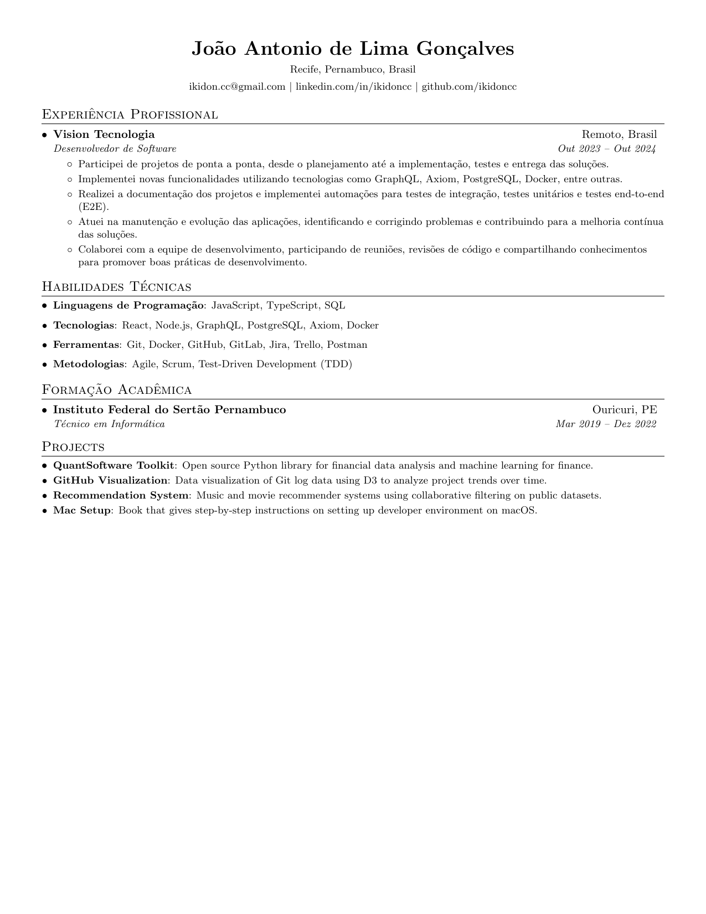

# Resume

LaTeX source for my resume. Single-column, ATS-friendly, one page.

Template derived from [sb2nov/resume](https://github.com/sb2nov/resume) and [harlleybastos/resume](https://github.com/harlleybastos/resume) (MIT).

## Preview

[](ikidon_resume.pdf)

_Latest build: [resume.pdf](ikidon_resume.pdf). Preview regenerated on each build._

## Build

### Locally (primary)

`resume.pdf` is compiled locally and committed, so it's always current here. Rebuild with:

```sh
./build.sh
```

It uses `tectonic` if available (self-contained), falling back to `latexmk` or `pdflatex` from any TeX Live / MiKTeX install.

### Overleaf

Upload `resume.tex` to a new [Overleaf](https://www.overleaf.com) project (or import this repo) and compile with pdfLaTeX.

### CI (optional)

A GitHub Actions workflow ([.github/workflows/build.yml](.github/workflows/build.yml)) compiles the PDF with [xu-cheng/latex-action](https://github.com/xu-cheng/latex-action) on push. Local build is the source of truth; CI is just a convenience.

## License

[MIT](LICENSE). Template derived from [sb2nov/resume](https://github.com/sb2nov/resume), also MIT — original attribution preserved.
