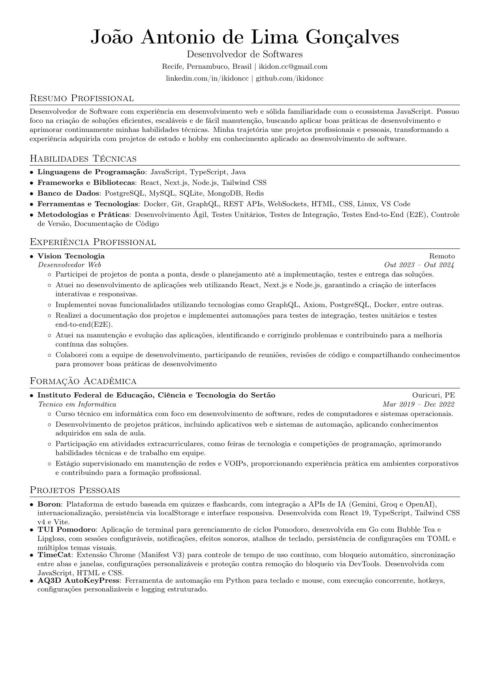

# Resume

Currículo profissional de **João Antonio de Lima Gonçalves**, desenvolvido em LaTeX com foco em uma apresentação simples, profissional e compatível com sistemas de leitura automatizada de currículos.

## Estrutura

* `resume.tex` — fonte do currículo em LaTeX
* `resume.pdf` — currículo compilado
* `resume_preview.png` — prévia do currículo utilizada no README
* `Dockerfile` — ambiente para compilação
* `build.sh` — script para gerar o PDF

## Requisitos

* Docker

## Compilação

Para gerar o currículo:

```bash
./build.sh
```

O script cria a imagem Docker e compila `resume.tex`, gerando `resume.pdf`.

Também é possível compilar manualmente:

```bash
docker build -t ikidon/latex .
docker run --rm -i -v "$PWD":/data ikidon/latex pdflatex resume.tex
```

## Preview

A imagem de prévia pode ser regenerada diretamente a partir do PDF usando `pdftoppm`:

```bash
pdftoppm -png -f 1 -singlefile -r 150 resume.pdf resume_preview
```

Isso gera:

```text
resume_preview.png
```

A imagem é utilizada abaixo para visualizar rapidamente o currículo sem precisar abrir o PDF.



## Template

O currículo é baseado no template de [Sourabh Bajaj](https://github.com/sb2nov/resume), disponibilizado sob a licença MIT.

O conteúdo do currículo foi completamente adaptado e é de autoria de João Antonio de Lima Gonçalves.
